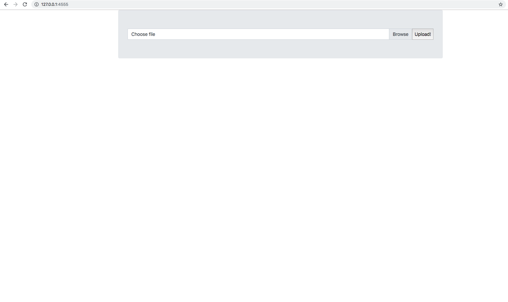
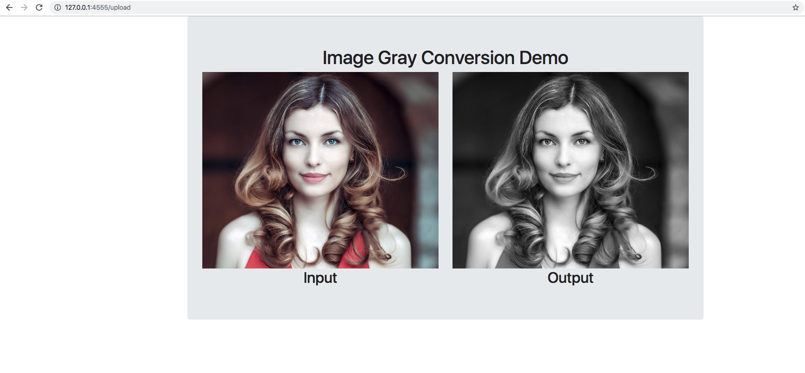

# flask-bgr2gray

This is a sample flask application that uses Bootstrap for the Frontend UI and OpenCV for image processing

## Dependencies
Flask
opencv-contrib-python
bootstrap

## How to Use

1. python app_basic.py

2. Go to 127.0.0.1:4555 on your browser.

## Output

You should get a screen shown below.

Choose Browse and upload an image. Click Upload to get the output

